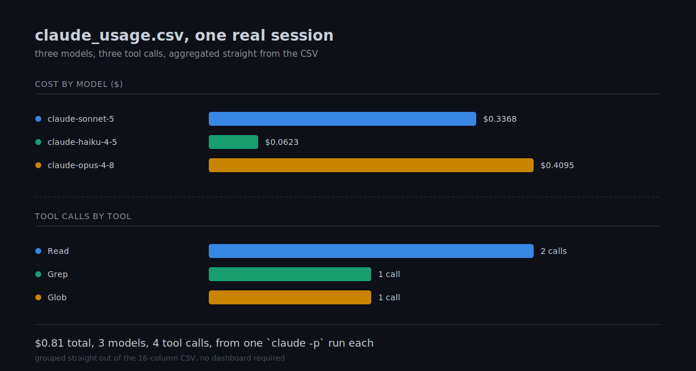
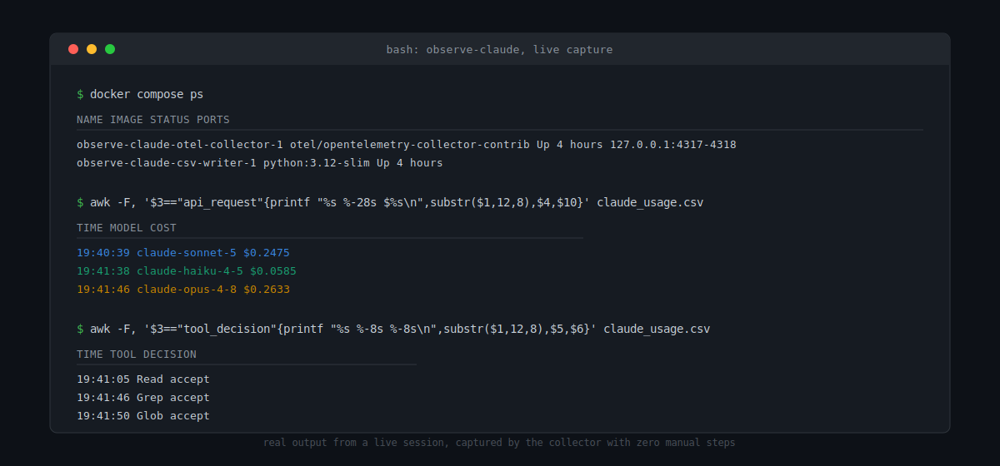

# observe-claude

Local capture of Claude Code session telemetry (tool usage, tokens, cost) into a CSV, no
manual export step required. ClickHouse ingestion is phase 2 — not wired up yet, the raw
JSONL is kept so it can be replayed into a different backend later without re-running any
Claude Code sessions.

## How it works

```
claude (OTLP) -> otel-collector -> data/claude-events.jsonl -> csv-writer -> claude_usage.csv
```

`docker-compose.yml` runs two containers:
- **otel-collector**: receives OTLP logs/metrics/traces from Claude Code, writes the raw
  export to `data/claude-events.jsonl`.
- **csv-writer**: polls that file every 5s and regenerates `claude_usage.csv` — always
  up to date, nothing to trigger by hand.

## Usage

```bash
# 1. Start the collector + csv-writer (leave this running)
docker compose up -d

# 2. In the terminal where you'll run Claude Code:
source env.sh
claude
# ... use Claude Code normally ...
```

That's it — `claude_usage.csv` updates itself every 5 seconds while the stack is up.

`claude_usage.csv` has one row per `api_request` (model, cost_usd, input/output/cache tokens),
`tool_result` (tool_name, success, duration_ms, error_type), and `tool_decision`
(tool_name, decision, source) event, joined by `session_id`.

## Sample output

Real rows from a live session (three `claude -p` calls, three models):

| timestamp | session_id | event_type | model | tool_name | decision | success | cost_usd | duration_ms |
|---|---|---|---|---|---|---|---|---|
| 2026-07-04T19:41:05.216Z | 4255b08c... | tool_decision | | Read | accept | | | |
| 2026-07-04T19:41:05.218Z | 4255b08c... | api_request | claude-sonnet-5 | | | | 0.076066 | 2958 |
| 2026-07-04T19:41:05.221Z | 4255b08c... | tool_result | | Read | | true | | 5 |
| 2026-07-04T19:41:46.045Z | 4a4f71f6... | tool_decision | | Grep | accept | | | |
| 2026-07-04T19:41:46.052Z | 4a4f71f6... | api_request | claude-opus-4-8 | | | | 0.26328 | 4415 |

Grouped by model and by tool, the same session looks like this:



And the collector receiving it, end to end:



## Gotchas

- **Telemetry env vars must be set before `claude` starts.** There's no way to turn on
  export retroactively for an already-running session.
- **Don't delete `data/claude-events.jsonl` while the collector is running.** The exporter
  holds the file open; deleting it from the host leaves the collector writing into a
  deleted, invisible inode until the container restarts. Use `docker compose restart
  otel-collector` if you need to reset it, not `rm` while it's live.
- **OTLP ports are bound to `127.0.0.1` only, on purpose.** The receiver has no auth or
  TLS — do not change this to `0.0.0.0` unless you add authentication, or anyone on your
  network can inject fake telemetry into your collector.
- The captured JSONL includes `user.email` and account/org UUIDs (prompt/response text is
  redacted by default). Don't commit `data/` or `*.csv` — both are already gitignored.

## Phase 2 (later)

`data/claude-events.jsonl` is the full raw OTLP export — nothing is discarded, so a second
collector pipeline can be pointed at it later (e.g. `filelog`/`otlpjsonfile` receiver ->
`clickhouse` exporter) to backfill ClickHouse without needing to re-run any Claude Code
sessions.
